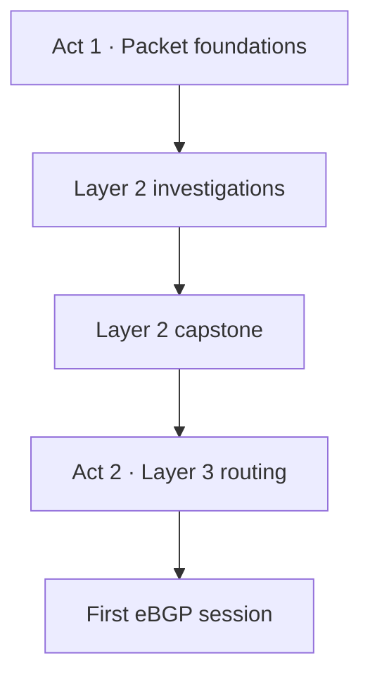

# Networking Zero to Hero Labs

[](https://github.com/azz-kikkr/intro-to-networking-labs/actions/workflows/checks.yml)
[](LICENSE)
[](LICENSE-CONTENT)
[](VERSION)

Free, local, evidence-first labs for Mission Tech's [How Networks Work](https://missioninstituteoftechnology.com/courses/how-networks-work) course.

Go from a browser request to Ethernet, ARP, switching, routing, and your first eBGP session. You will not just make traffic pass. You will predict what should happen, inspect the network's state, capture the traffic, and explain what the evidence proves.

> **Predict. Build. Prove. Explain.** The browser is the control room. The Linux kernel is the network.

## Start here

| I want to... | Go here |
|---|---|
| Take the complete course from the beginning | **[Open the learner start guide](docs/00-start-here.md)** |
| See the full lab sequence | [Review the course map](#course-map) |
| Start the BGP section | [Go to Lab 07](docs/lab-07-first-ebgp-session.md) |
| Fix an environment or lab problem | [Open troubleshooting](docs/troubleshooting.md) |
| Contribute a lab or improvement | [Read the contributor guide](CONTRIBUTING.md) |

If this is your first time here, use the learner start guide. It separates the Linux requirements for Act 1 from the Docker requirements for Act 2 and walks you through the first successful lab run.

## What you will learn

By the end of the current course, you will be able to:

- trace a browser request through HTTP, TCP, IPv4, Ethernet, and ARP
- use Linux routes, neighbor tables, bridge FDBs, VLAN state, and STP state as evidence
- explain what changes at a router and what remains end to end
- distinguish known unicast, unknown unicast, and broadcast forwarding
- diagnose VLAN, PVID, MAC-learning, STP, path-cost, and failover behavior
- establish an eBGP session and interpret next hop, prefix count, and AS path
- state the limits of a ping, a packet capture, a routing table, or any single observation

No cloud account, paid service, telemetry, or production network is required.

## Learning path



### Act 1: From browser to Layer 2

Act 1 uses Linux network namespaces, veth pairs, bridges, routes, packet captures, and kernel state. Labs 01 to 05 are bounded investigations. Lab 06 combines them in a redundant, VLAN-aware campus fabric.

### Act 2: Routing between Autonomous Systems

Act 2 uses Docker containers running [FRRouting](https://frrouting.org/). You configure and inspect real routing software while keeping every container and network isolated to the course.

## Course map

| Act | Lab | Time | What you build | Evidence you leave with |
|---:|---|---:|---|---|
| 1 | [01 · Browser to Wire](docs/lab-01-browser-to-wire.md) | 35 min | Isolated HTTP client, bridge, and server | HTTP, route, bridge, and PCAP evidence agree |
| 1 | [02 · IP Addresses](docs/lab-02-ip-addresses.md) | 30 min | Two endpoints on a `/26` | Address and connected-route evidence |
| 1 | [03 · Subnet Boundaries](docs/lab-03-subnet-boundaries.md) | 40 min | Two subnets joined by a router | Paired captures show L2 rewrite and TTL change |
| 1 | [04 · Ethernet Frames](docs/lab-04-ethernet-frames.md) | 40 min | Sender, receiver, witness, and bridge | FDB state plus unicast and flooding evidence |
| 1 | [05 · ARP Resolution](docs/lab-05-arp-resolution.md) | 30 min | A fresh IPv4-to-MAC resolution | ARP request/reply and neighbor-table evidence |
| 1 | [06 · Layer 2 Capstone](docs/lab-06-layer2-capstone.md) | 90–120 min | Redundant four-switch VLAN fabric | VLAN, FDB, STP, failure, and repair evidence |
| 2 | [07 · Your First eBGP Session](docs/lab-07-first-ebgp-session.md) | 45 min | Two FRR routers in separate ASNs | Session state, routes, next hops, and AS paths |

Before Lab 06, complete the [capstone readiness primer](docs/capstone-readiness.md). It covers FDB learning, access and trunk behavior, PVIDs, STP root selection, path cost, and failover.

## Requirements

The two acts intentionally use different environments.

| | Act 1 · Kernel networking | Act 2 · BGP |
|---|---|---|
| Recommended environment | Clean Ubuntu VM | Linux, macOS, or Windows with WSL2 |
| Also supported | WSL2 Ubuntu where the lab guide says so | Docker Desktop or Docker Engine |
| Main requirement | `sudo` and a kernel that permits namespaces, veth pairs, and bridges | Docker Engine and Docker Compose |
| Docker | Prefer a host without Docker installed | Required |
| AWS/cloud account | Not required | Not required |

Never run Act 1 on a production host. Docker can change bridge packet-filtering behavior, so use a clean Ubuntu VM without Docker for the most reliable Act 1 and capstone experience. See [Troubleshooting](docs/troubleshooting.md) for the exact reason.

## Quick start

### 1. Clone the course

```bash
git clone https://github.com/azz-kikkr/intro-to-networking-labs.git
cd intro-to-networking-labs
chmod +x scripts/*.sh tests/*.sh
```

### 2. Prepare Act 1

```bash
sudo ./scripts/mission-act1-labs.sh lab01 install
sudo ./scripts/mission-act1-labs.sh lab01 doctor
```

Do not continue until `doctor` passes. It checks real namespace, veth, bridge, and packet-capture feasibility on your kernel.

### 3. Run the first lab

Read [Lab 01: Browser to Wire](docs/lab-01-browser-to-wire.md), write your prediction, and then run:

```bash
sudo ./scripts/mission-act1-labs.sh lab01 build
sudo ./scripts/mission-act1-labs.sh lab01 verify
sudo ./scripts/mission-act1-labs.sh lab01 capture
sudo ./scripts/mission-act1-labs.sh lab01 destroy
```

The capture and readable evidence remain under a timestamped `results/` directory after cleanup.

### 4. Prepare Act 2 when you reach Lab 07

```bash
./scripts/mission-act2-bgp.sh doctor
./scripts/mission-act2-bgp.sh prep
```

Then follow [Lab 07](docs/lab-07-first-ebgp-session.md). You can begin with Act 2 directly if you already understand Ethernet, ARP, switching, subnets, and route lookup.

For the complete setup, environment choices, expected output, and evidence workflow, use **[Start Here](docs/00-start-here.md)**.

## How every lab works

| Step | What you do | Why it matters |
|---|---|---|
| **Predict** | Write what you expect before running commands | Makes the lab a test of a network model, not command copying |
| **Build** | Create one bounded topology | Keeps the question and failure domain small |
| **Verify** | Check the known-good baseline | Separates environment failure from the lesson |
| **Capture** | Generate controlled traffic and save state | Produces evidence you can inspect later |
| **Explain** | Cite fields, tables, or state and name a limitation | Turns output into defensible reasoning |
| **Destroy** | Remove only the lab's exact resources | Leaves the host clean while preserving results |

A command that exits nonzero did not pass. Read the `[FAIL]` message and fix the cause before treating later output as evidence.

## Evidence contract

Every lab separates three questions:

1. What did the learner-facing command report?
2. What state does the Linux kernel or router expose?
3. What does the packet capture or routing table prove?

Evidence stays local under `results/`. Act 1 includes bounded PCAPs, readable summaries, and checksums. Act 2 includes BGP session state, route tables, running configurations, and manifests. No telemetry is collected.

The [packet capture field guide](docs/packet-capture-field-guide.md) shows how to read Ethernet, ARP, IPv4, TCP, and HTTP evidence from the outside in.

## Safety boundary

The learner runners are deliberately constrained:

- Act 1 creates only `mls1`-prefixed namespaces, virtual links, and bridges
- Act 2 creates only `mls1-bgp`-prefixed containers and Docker networks
- captures and polling are bounded
- background processes are tracked by exact PID
- cleanup targets only exact lab resources
- no physical interface, host default route, host firewall, or WSL external interface is modified
- no accounts, SaaS services, telemetry, or production traffic are used

The scripts will fail rather than weaken the host's firewall or security posture to make a lab pass.

## Repository guide

```text
docs/       Learner guides, primers, troubleshooting, and topology diagrams
labs/       Declarative files for container-based routing labs
scripts/    Act 1, capstone, and Act 2 learner runners
tests/      Static acceptance and real runtime smoke tests
pcaps/      Packet-capture handling and release guidance
results/    Local evidence created when you run a lab (not committed)
```

## Validation

Maintainers and contributors can run the same static gates used by CI:

```bash
bash -n scripts/*.sh tests/*.sh
shellcheck -x scripts/*.sh tests/*.sh
LC_ALL=C bash tests/acceptance.sh
LC_ALL=C.UTF-8 bash tests/acceptance.sh
bash tests/act2-acceptance.sh
```

Runtime checks require the target environment:

```bash
# Act 1 on a disposable Ubuntu host
sudo bash tests/smoke.sh

# Act 2 on a host with Docker
bash tests/act2-smoke.sh
```

A release-quality run ends with `failed 0, skipped 0` and no remaining `mls1` namespaces, links, containers, or networks. Static checks alone do not prove privileged kernel or Docker feasibility.

## Help and contributing

Start with [Troubleshooting](docs/troubleshooting.md). If the problem remains, [open an issue](https://github.com/azz-kikkr/intro-to-networking-labs/issues) and include:

- operating system and version
- kernel version from `uname -a`
- the exact command you ran
- the complete `[FAIL]` output
- whether `doctor` passed

Contributions are welcome. Read [CONTRIBUTING.md](CONTRIBUTING.md) before changing learner commands, network behavior, or safety boundaries.

## Licenses

Code is licensed under the [MIT License](LICENSE). Workshop text and diagrams are licensed under [CC BY 4.0](LICENSE-CONTENT).
