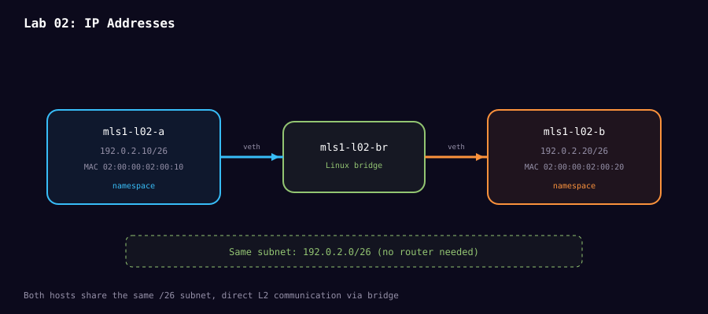

# Lab 02: IP addresses, proven

**Level:** L2 guided lab<br>
**Time:** 30 minutes<br>
**Question:** What does the `/26` change in kernel behavior?

## Topology



```text
192.0.2.10/26 -- mls1 bridge -- 192.0.2.20/26
```

Predict the network, broadcast, usable range, and whether a gateway is needed.

```bash
sudo ./scripts/mission-act1-labs.sh lab02 build
sudo ./scripts/mission-act1-labs.sh lab02 verify
sudo ./scripts/mission-act1-labs.sh lab02 capture
```

Read `address.txt`, `routes.txt`, and `ipv4-header.pcap`. In Wireshark use `icmp` and inspect `ip.src`, `ip.dst`, TTL, protocol, and checksum status. The connected route is kernel evidence. ICMP echo packets are wire evidence. Ping is only the traffic generator.

Expected result: both endpoints are inside `192.0.2.0/26`, the route is directly connected, and no router is used.

Challenge: predict what changes if the second address becomes `192.0.2.70/26`. Do not change the lab until you can explain the route lookup.

Done when your explanation includes address, prefix, connected route, and one IPv4 header field.

## Study links

- [RFC 4632: CIDR](https://datatracker.ietf.org/doc/html/rfc4632#section-3.1) explains prefix notation and which IPv4 bits identify the network.
- [`ip-address(8)`](https://man7.org/linux/man-pages/man8/ip-address.8.html) documents how Linux assigns protocol addresses to interfaces.
- [`ip-route(8)`](https://man7.org/linux/man-pages/man8/ip-route.8.html) documents the routing-table entries you inspect in this lab.

```bash
sudo ./scripts/mission-act1-labs.sh lab02 destroy
```