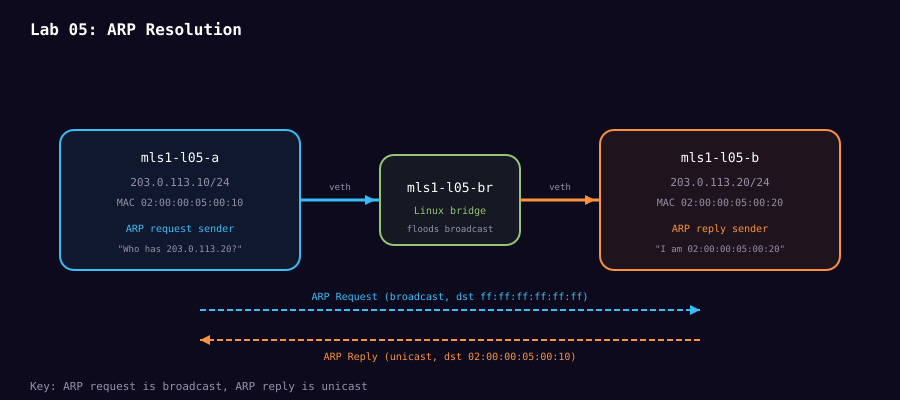

# Lab 05: ARP resolution

**Level:** L2 guided investigation<br>
**Time:** 30 minutes<br>
**Question:** How does an IPv4 destination become an Ethernet destination?

Predict the neighbor-table state before traffic, the request destination MAC, and the reply destination MAC.



```bash
sudo ./scripts/mission-act1-labs.sh lab05 build
sudo ./scripts/mission-act1-labs.sh lab05 verify
sudo ./scripts/mission-act1-labs.sh lab05 flush
sudo ./scripts/mission-act1-labs.sh lab05 capture
```

Open `arp-request-reply.pcap` with filter `arp`. Inspect `arp.opcode`, sender IP/MAC, target IP/MAC, and Ethernet destination. Compare the final mapping with `neighbors.txt`.

Expected result: a broadcast request asks for the owner of `203.0.113.20`; a unicast reply supplies the MAC; the kernel neighbor table then holds the mapping. The capture proves the exchange. The table proves retained kernel state.

Done when you can distinguish an ARP target hardware field containing zeros from the Ethernet broadcast destination.

## Study links

- [RFC 826: Ethernet Address Resolution Protocol](https://datatracker.ietf.org/doc/html/rfc826) defines ARP request and reply fields and processing.
- [`ip-neighbour(8)`](https://man7.org/linux/man-pages/man8/ip-neighbour.8.html) documents Linux neighbor-table states and commands.
- [Wireshark ARP field reference](https://www.wireshark.org/docs/dfref/a/arp.html) lists the exact fields used in the capture.

```bash
sudo ./scripts/mission-act1-labs.sh lab05 destroy
```