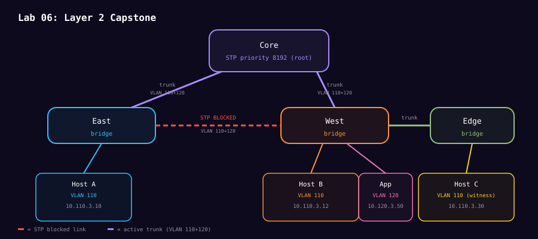

# Lab 06: Layer 2 capstone

**Level:** L2 capstone<br>
**Time:** 75 minutes<br>
**Question:** Can you explain and repair a redundant, VLAN-aware four-switch fabric from evidence?

Complete the [Layer 2 capstone readiness primer](capstone-readiness.md) before you begin. You should be able to predict FDB flooding, VLAN membership and the active STP path.

## Topology



```text
            Core
           /    \
        East----West----Edge
         A110    B110     C110 witness
                 App120
```

The kernel uses classic STP, not RSTP. Predict the root bridge, one blocked path, and which endpoints share a broadcast domain.

```bash
sudo ./scripts/mission-layer2-capstone.sh doctor
sudo ./scripts/mission-layer2-capstone.sh build
sudo ./scripts/mission-layer2-capstone.sh verify
sudo ./scripts/mission-layer2-capstone.sh topology
```

Run investigations one at a time. Stateful investigations require `fix` before the next.

```bash
sudo ./scripts/mission-layer2-capstone.sh demo port-roles
sudo ./scripts/mission-layer2-capstone.sh demo vlan-boundaries
sudo ./scripts/mission-layer2-capstone.sh demo fdb-learning
sudo ./scripts/mission-layer2-capstone.sh demo unknown-unicast
sudo ./scripts/mission-layer2-capstone.sh demo broadcast-domain
sudo ./scripts/mission-layer2-capstone.sh demo root-election
sudo ./scripts/mission-layer2-capstone.sh fix
sudo ./scripts/mission-layer2-capstone.sh demo path-cost
sudo ./scripts/mission-layer2-capstone.sh fix
sudo ./scripts/mission-layer2-capstone.sh demo link-failover
sudo ./scripts/mission-layer2-capstone.sh fix
```

Then investigate `trunk-pruning`, `pvid-mismatch`, and `mac-move`, repairing each with `fix`. Before each demo, write: expected symptom, kernel command that should reveal it, and packet evidence if applicable.

## Evidence rubric

A complete submission names the root bridge, identifies forwarding and blocking ports, explains VLAN 110/120 isolation, shows where Host B's MAC was learned before and after a move, and cites the marked payload in both flooding PCAPs. It also states that successful ping alone does not prove the forwarding path.

All captures must be nonempty and readable. `manifest.txt` records SHA-256 checksums. Commands fail explicitly when an asserted observation is absent.

## Study links

- [Linux kernel Ethernet bridging](https://docs.kernel.org/networking/bridge.html) is the primary reference for Linux bridge STP, VLAN filtering, ports, and FDB behavior.
- [`bridge(8)`](https://man7.org/linux/man-pages/man8/bridge.8.html) documents `bridge link`, `bridge fdb`, and `bridge vlan`.
- [`ip-link(8)` bridge options](https://man7.org/linux/man-pages/man8/ip-link.8.html) documents bridge creation, STP state, timers, and VLAN filtering.
- [Wireshark display filter reference](https://www.wireshark.org/docs/dfref/) helps turn the capstone questions into precise frame filters.

```bash
sudo ./scripts/mission-layer2-capstone.sh evidence
sudo ./scripts/mission-layer2-capstone.sh destroy
```