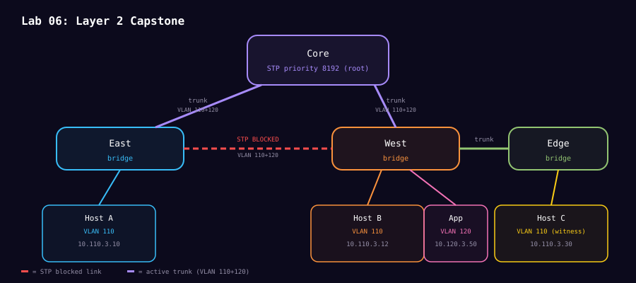

# Lab 06: Layer 2 capstone

[← Lab 05: ARP Resolution](lab-05-arp-resolution.md) · [Course home](../README.md) · [Lab 07: Your First eBGP Session →](lab-07-first-ebgp-session.md)

**Level:** L2 capstone<br>
**Time:** 90–120 minutes<br>
**Question:** Can you explain and repair a redundant, VLAN-aware four-switch fabric from evidence?

## Learning objectives

By the end of this lab, you will be able to:

- explain VLAN membership, FDB learning, and STP port roles in one topology
- diagnose deliberate trunk, PVID, MAC-move, path-cost, and link failures
- repair each failure and prove that the intended state returned
- distinguish reachability from evidence of the actual forwarding path

## Before you begin

Complete the [Layer 2 capstone readiness primer](capstone-readiness.md). You should be able to predict all three of these before inspecting Linux state:

1. where a bridge learns a source MAC and where it floods an unknown destination
2. which untagged endpoint traffic belongs to each PVID and which VLANs cross each trunk
3. which bridge becomes the STP root and which redundant path should block

Use a clean Ubuntu VM without Docker installed. The runner will not change the host firewall or unload kernel modules to make the topology pass.

Prepare the runner:

```bash
sudo ./scripts/mission-layer2-capstone.sh install
sudo ./scripts/mission-layer2-capstone.sh doctor
```

Do not continue until `doctor` passes.

## Topology



```text
            Core
           /    \
        East----West----Edge
         A110    B110     C110 witness
                 App120
```

The Linux kernel uses classic STP, not RSTP. The topology contains two endpoint VLANs and redundant switch paths.

## Predict

Before building, write down:

- the expected root bridge
- one port you expect STP to block
- which endpoints share a broadcast domain
- where Host B's MAC should appear in the FDB
- which path should activate if the preferred trunk fails

Do not change an answer after seeing the output. Add a correction beside it and explain what your original model missed.

## Build and verify

```bash
sudo ./scripts/mission-layer2-capstone.sh build
sudo ./scripts/mission-layer2-capstone.sh verify
sudo ./scripts/mission-layer2-capstone.sh topology
```

`verify` proves the clean baseline. If it fails, stop and resolve the environment or topology before beginning an investigation.

## Investigate the clean fabric

Run the read-only investigations first:

```bash
sudo ./scripts/mission-layer2-capstone.sh demo port-roles
sudo ./scripts/mission-layer2-capstone.sh demo vlan-boundaries
sudo ./scripts/mission-layer2-capstone.sh demo fdb-learning
sudo ./scripts/mission-layer2-capstone.sh demo unknown-unicast
sudo ./scripts/mission-layer2-capstone.sh demo broadcast-domain
```

For each investigation, record:

1. the expected observation
2. the exact kernel command or PCAP field that supports it
3. what the observation cannot prove by itself

## Change, observe, and repair

Stateful demonstrations deliberately change the fabric. Run only one at a time and use `fix` before starting the next.

```bash
sudo ./scripts/mission-layer2-capstone.sh demo root-election
sudo ./scripts/mission-layer2-capstone.sh fix

sudo ./scripts/mission-layer2-capstone.sh demo path-cost
sudo ./scripts/mission-layer2-capstone.sh fix

sudo ./scripts/mission-layer2-capstone.sh demo link-failover
sudo ./scripts/mission-layer2-capstone.sh fix

sudo ./scripts/mission-layer2-capstone.sh demo trunk-pruning
sudo ./scripts/mission-layer2-capstone.sh fix

sudo ./scripts/mission-layer2-capstone.sh demo pvid-mismatch
sudo ./scripts/mission-layer2-capstone.sh fix

sudo ./scripts/mission-layer2-capstone.sh demo mac-move
sudo ./scripts/mission-layer2-capstone.sh fix
```

Before each demo, predict the symptom, the command that should reveal it, and the packet evidence if the scenario produces traffic. After `fix`, confirm that the original baseline is restored.

Use `reset` only when you intentionally want to rebuild the entire clean topology:

```bash
sudo ./scripts/mission-layer2-capstone.sh reset
```

## Collect evidence

```bash
sudo ./scripts/mission-layer2-capstone.sh evidence
```

The command prints the timestamped results directory. All captures must be nonempty and readable. `manifest.txt` records SHA-256 checksums so the evidence set can be reviewed later.

## Evidence rubric

A complete submission:

- names the root bridge and cites the state that proves it
- identifies forwarding and blocking ports
- explains why VLAN 110 and VLAN 120 are isolated
- shows where Host B's MAC was learned before and after a move
- cites the marked payload in the unknown-unicast and broadcast captures
- explains one failure, its repair, and the evidence that the baseline returned
- states why successful ping alone does not prove the forwarding path

Commands fail explicitly when an asserted observation is absent. Do not replace a missing artifact with a reachability claim.

## Done when

You can defend the active Layer 2 path from VLAN, FDB, and STP state, repair every deliberate fault, reopen the saved evidence, and state one limitation of each evidence type.

## Cleanup

```bash
sudo ./scripts/mission-layer2-capstone.sh destroy
```

The command removes every Lab 06 object and tracked process while preserving `results/`.

## Study links

- [Linux kernel Ethernet bridging](https://docs.kernel.org/networking/bridge.html) is the primary reference for Linux bridge STP, VLAN filtering, ports, and FDB behavior.
- [`bridge(8)`](https://man7.org/linux/man-pages/man8/bridge.8.html) documents `bridge link`, `bridge fdb`, and `bridge vlan`.
- [`ip-link(8)` bridge options](https://man7.org/linux/man-pages/man8/ip-link.8.html) documents bridge creation, STP state, timers, and VLAN filtering.
- [Wireshark display filter reference](https://www.wireshark.org/docs/dfref/) helps turn capstone questions into precise frame filters.

[Continue to Lab 07: Your First eBGP Session →](lab-07-first-ebgp-session.md)
