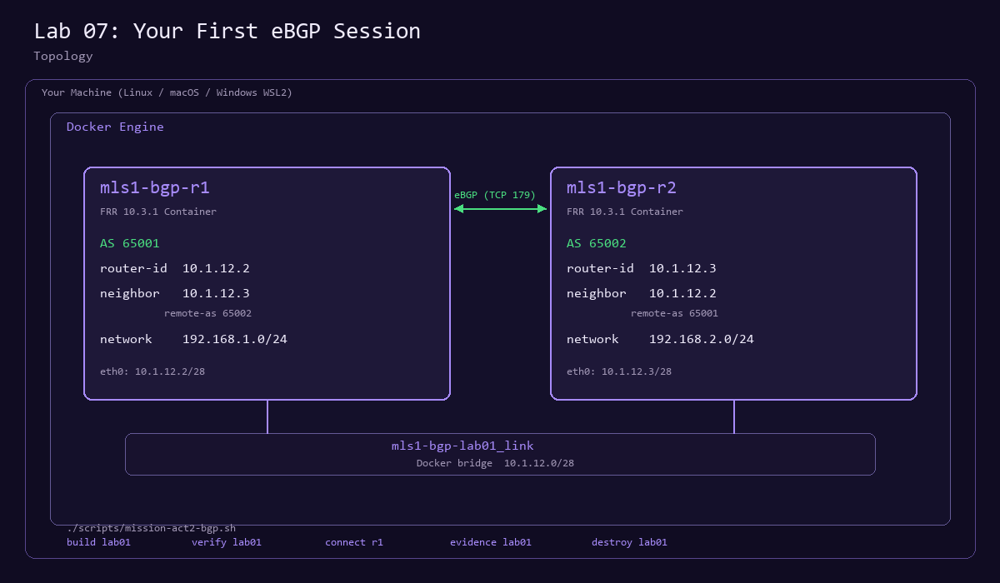

# Lab 07: Your first eBGP session

**Level:** L3 guided lab<br>
**Time:** 45 minutes<br>
**Question:** How do two routers in different Autonomous Systems agree on where to send traffic?

## Prerequisites

Act 2 labs use Docker containers instead of Linux namespaces. You need:

- Docker Engine (or Docker Desktop on Windows/macOS) running
- Docker Compose plugin installed
- No `sudo` required if your user is in the `docker` group

Confirm your environment:

```bash
./scripts/mission-act2-bgp.sh doctor
```

Expected:

```text
[PASS] Docker is installed and running
[PASS] Docker Compose is available
[PASS] Environment is ready
```

Pull the FRR image once (about 200 MB):

```bash
./scripts/mission-act2-bgp.sh prep
```

## Topology



Two FRR routers run inside Docker containers connected by a bridge network. Each router belongs to a different Autonomous System and advertises one prefix via eBGP. The Docker Compose project uses the `mls1-bgp-lab01` prefix so all resources are scoped and removable with one command.

## Concepts

| Term | Meaning |
|------|---------|
| Autonomous System (AS) | A group of IP networks under one administrative domain, identified by an AS number. |
| eBGP | External BGP: a session between routers in different Autonomous Systems. |
| Neighbor | A configured BGP peer identified by IP address and remote AS number. |
| Network advertisement | A router announces its own prefix to peers with the `network` command. |
| Prefix learning | A router installs prefixes received from its BGP neighbors into its routing table. |
| BGP session states | Idle, Connect, Active, OpenSent, OpenConfirm, Established. Routes exchange only in Established. |

## Predict

Before running anything, write answers to:

1. After the session reaches Established, how many prefixes will r1 show in its BGP table?
2. What AS path will r1 report for the prefix 192.168.2.0/24?
3. What next hop will r1 use for traffic destined to 192.168.2.0/24?

## Build and verify

```bash
./scripts/mission-act2-bgp.sh build lab01
```

This starts both containers, waits up to 90 seconds for BGP convergence, and confirms all checks pass. Expected output ends with:

```text
[PASS] BGP sessions established and prefixes learned
```

Run the explicit verification:

```bash
./scripts/mission-act2-bgp.sh verify lab01
```

Expected:

```text
[PASS] Router r1 is running
[PASS] Router r2 is running
[PASS] r1 has established BGP session with r2 (10.1.12.3)
[PASS] r2 has established BGP session with r1 (10.1.12.2)
[PASS] r1 has learned 192.168.2.0/24 from r2
[PASS] r2 has learned 192.168.1.0/24 from r1

6/6 checks passed
```

## Inspect router state

Connect to r1:

```bash
./scripts/mission-act2-bgp.sh connect r1
```

You are now inside the FRR `vtysh` shell. Run these commands and record the output:

```text
show bgp summary
show ip bgp
show ip bgp neighbors 10.1.12.3 received-routes
```

Key observations on r1:

| Field | Expected value |
|-------|----------------|
| State/PfxRcd for 10.1.12.3 | 1 (session is Established, one prefix received) |
| BGP table entry for 192.168.1.0/24 | Next hop 0.0.0.0, locally originated |
| BGP table entry for 192.168.2.0/24 | Next hop 10.1.12.3, path 65002 i |

Type `exit` to leave vtysh. Then connect to r2 and repeat:

```bash
./scripts/mission-act2-bgp.sh connect r2
```

```text
show bgp summary
show ip bgp
show ip bgp neighbors 10.1.12.2 received-routes
```

r2 is the mirror: it sees 192.168.1.0/24 learned from AS 65001 with next hop 10.1.12.2.

## Collect evidence

```bash
./scripts/mission-act2-bgp.sh evidence lab01
```

This saves timestamped files under `results/`:

- `r1-bgp-summary.txt` and `r2-bgp-summary.txt` (session state)
- `r1-bgp-table.txt` and `r2-bgp-table.txt` (learned prefixes)
- `r1-bgp-table.json` and `r2-bgp-table.json` (machine-readable BGP RIB)
- `r1-running-config.txt` and `r2-running-config.txt` (full configuration)
- `r1-bgp-neighbors.txt` and `r2-bgp-neighbors.txt` (detailed peer state)
- `verify-output.txt` (verification results)
- `manifest.txt` (metadata and version)

## Evidence contract

| Question | Where to look |
|----------|---------------|
| What did the router report? | `show bgp summary` shows session state and prefix count |
| What state does the routing table expose? | `show ip bgp` shows the RIB with next hops and AS paths |
| What proves the prefix was learned from the peer? | `show ip bgp` entries with a non-local peerId and AS path confirm the route crossed an AS boundary |

## Explain

After reviewing the evidence:

1. Why does 192.168.1.0/24 on r1 have next hop 0.0.0.0 and weight 32768?
2. Why does 192.168.2.0/24 on r1 show AS path "65002 i"?
3. What would happen if you changed r2's `remote-as` from 65001 to 65001**1** (a typo)?

## Done when

You can cite the BGP summary showing Established state, point to the AS path proving the route crossed an AS boundary, and explain that this evidence proves only this isolated lab session.

## Cleanup

```bash
./scripts/mission-act2-bgp.sh destroy lab01
```

This removes both containers and the Docker bridge network.

## Study links

- [FRRouting BGP documentation](https://docs.frrouting.org/en/latest/bgp.html) covers neighbor configuration, address families, and show commands.
- [RFC 4271: BGP-4](https://datatracker.ietf.org/doc/html/rfc4271) is the protocol specification. Focus on sections 4 (message formats) and 8 (path attributes).
- [RIPE NCC BGP tutorial](https://www.ripe.net/publications/docs/ripe-580) provides a practical overview of BGP operations and AS relationships.
