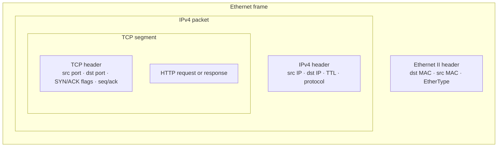

# Packet capture field guide

A packet capture is evidence only when you can explain where it was taken, what traffic generated it and which field proves the claim.

## How one frame nests every layer below

Read a capture from the outside in: the Ethernet header tells you which two NICs exchanged the frame, the IPv4 header tells you which two hosts the packet claims to connect end to end, and the TCP header tells you which two ports and which side of the handshake you are looking at. HTTP only exists once all three lower headers are already valid.

## Ethernet

Use `tcpdump -e` or expand **Ethernet II** in Wireshark. Record the destination MAC, source MAC, EtherType and whether the destination is unicast, multicast or broadcast.

## ARP

The request normally uses Ethernet broadcast. The reply can use unicast because the responder learned the requester's MAC from the request.

## IPv4

Record source, destination, TTL and protocol. A router changes the local Ethernet envelope while preserving end-to-end IPv4 endpoints unless NAT is involved.

## TCP and HTTP

Identify SYN, SYN-ACK and ACK before looking for HTTP. In Lab 01, the HTTP request cannot precede the TCP connection that carries it.

## Capture discipline

- State the capture interface.
- Bound the capture by packet count and timeout.
- Generate one known stimulus.
- Save command output beside the PCAP.
- Do not treat ping success alone as protocol proof.